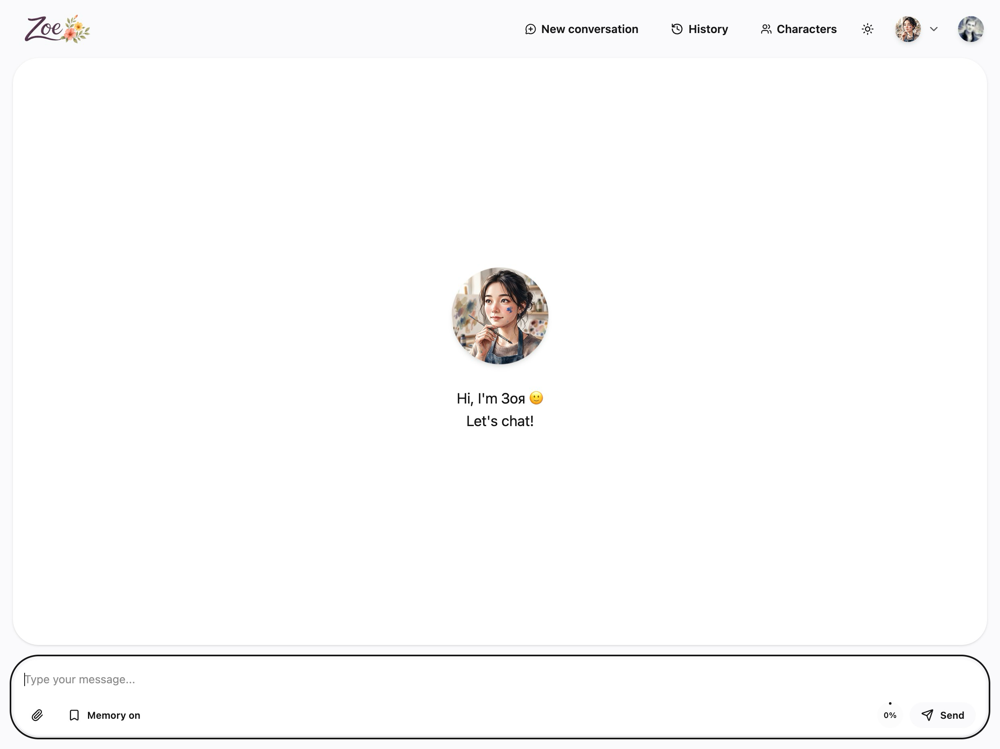
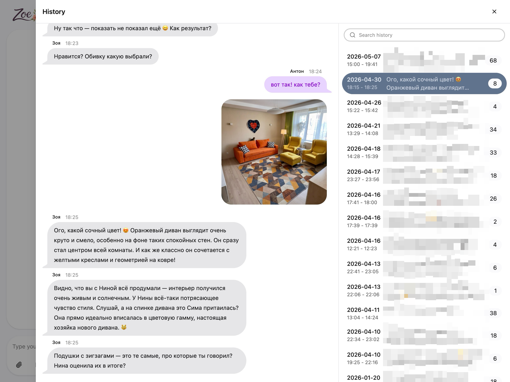
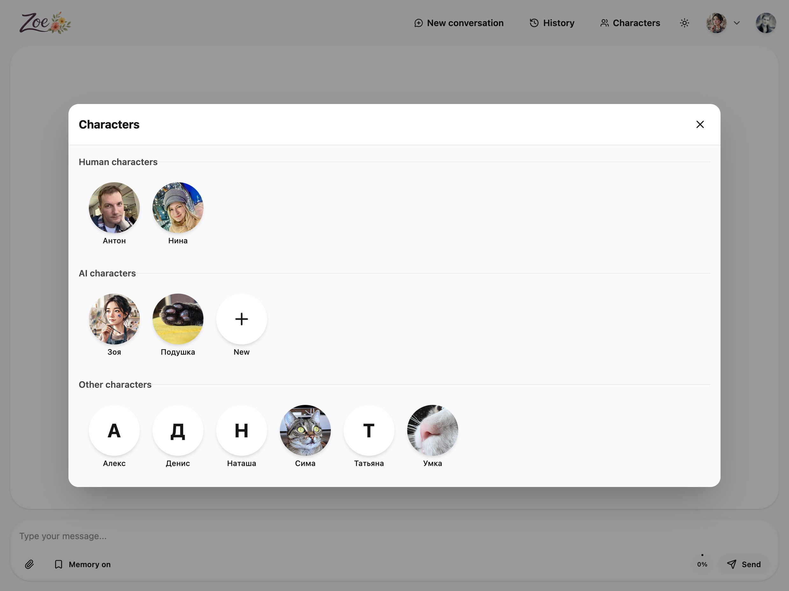
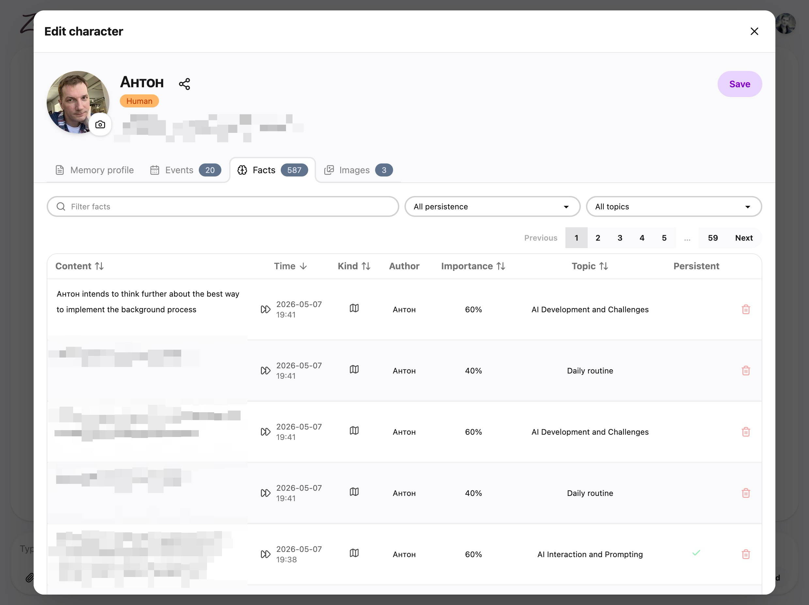
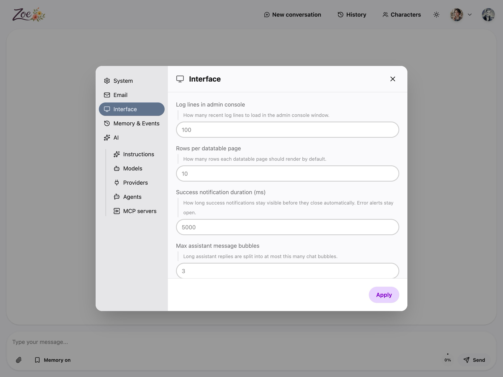

# Zoe AI

Zoe AI is a Rails-based multi-character AI companion platform built around persistent memory, not disposable chat sessions.

Most chatbots are optimized to answer the current prompt well. Zoe is optimized to build a durable understanding of people over time: who they are, what they care about, what changed recently, and which details should still matter months later.

It is also not limited to a single user talking to a single bot. Many users can register, create multiple characters, talk to different AI or human-like personas, and share characters between accounts so those characters accumulate a common memory across relationships and conversations.

## What makes Zoe different

- **Persistent memory is the product, not a bolt-on.** Zoe extracts structured facts from conversations and stores them as first-class application data.
- **It is multi-user and multi-character by design.** Users are not locked into one assistant identity. They can create and manage multiple characters with distinct roles, instructions, and histories.
- **Characters can be shared.** The same character can belong to multiple users, which makes shared memory a product feature instead of a workaround.
- **It separates long-term identity from short-term events.** A stable preference and a one-off plan are not treated the same, which makes memory more useful and less noisy.
- **Memory is organized by person and topic.** Facts are attached to characters and grouped into topic-based aggregates, so recall can stay specific instead of collapsing into a single summary blob.
- **Memory evolves over time.** Zoe maintains monthly and rolling summaries of persistent facts, which lets it keep a compressed but durable picture of someone as conversations accumulate.
- **Conversations stay conversational.** Fact extraction and summarization run asynchronously in background jobs, so the chat flow remains responsive while memory is updated behind the scenes.
- **It is built as a conventional Rails app.** The core is ActiveRecord models, Hotwire and Stimulus for the interactive UI, background jobs, prompt templates, and service actors rather than a black-box chatbot stack.

In practice, Zoe behaves less like a stateless assistant and more like an AI relationship layer: create characters, chat, remember, refine, share, and reuse that memory in later conversations.

## Screenshots

### Main chat



### Chat history



### Characters list



### Character profile



### Settings



## How it works

1. A user sends a message in a chat.
2. Zoe replies using the configured LLM provider and model.
3. The conversation is replayed through a fact extraction agent.
4. Extracted facts are stored with subject, author, topic, time, importance, and persistence metadata.
5. Persistent facts are re-aggregated into monthly and rolling summaries.
6. Future chats can use those summaries as long-term memory context.

## Tech stack

- Ruby on Rails 8
- PostgreSQL
- Hotwire and Stimulus
- Solid Queue for background jobs
- RubyLLM for model/provider integration
- Bun, Tailwind, and DaisyUI for frontend assets

## Local development

### Prerequisites

- PostgreSQL
- RVM with the project Ruby/gemset workflow
- Bun

If you follow the project contributor setup, run Rails and Ruby commands through:

```bash
bash -lc "rvm 4.0.4@zoe-ai do <command>"
```

### 1. Install dependencies

```bash
bash -lc "rvm 4.0.4@zoe-ai do bundle install"
bun install
```

### 2. Configure application settings and environment variables

Most runtime configuration lives in the `settings` system.

- Non-static settings can be configured from the UI and via environment variables.
- Environment variables use the `ZOE_` prefix.
- If a setting is provided via ENV, that value overrides the UI/database value.
- ENV-backed settings become effectively read-only from the UI.
- Static settings are boot-time only and should be configured via ENV.

Create a local env file at:

```bash
.env.development.local
```

For chat to work, set at least one provider API key there, for example:

```bash
ZOE_AI__PROVIDERS__OPENAI__API_KEY=...
```

Optional values such as Google OAuth, mailer settings, host overrides, and default model selection can also be configured in the same file.

### 3. Available environment variables

#### App

- `ZOE_APP__HOST`
- `ZOE_APP__PORT`
- `ZOE_APP__PROTOCOL`
- `ZOE_APP__SELF_REGISTRATION`
- `ZOE_APP__EXTRA_HOSTS` (static, boot-only)

#### AI

- `ZOE_AI__DEBUG`
- `ZOE_AI__REQUEST_TIMEOUT`
- `ZOE_AI__MODELS__DEFAULT_MODEL`
- `ZOE_AI__MODELS__DEFAULT_EMBEDDING_MODEL`
- `ZOE_AI__MODELS__DEFAULT_IMAGE_MODEL`

#### AI providers

- `ZOE_AI__PROVIDERS__OPENAI__API_KEY`
- `ZOE_AI__PROVIDERS__ANTHROPIC__API_KEY`
- `ZOE_AI__PROVIDERS__GEMINI__API_KEY`
- `ZOE_AI__PROVIDERS__MISTRAL__API_KEY`
- `ZOE_AI__PROVIDERS__PERPLEXITY__API_KEY`
- `ZOE_AI__PROVIDERS__XAI__API_KEY`
- `ZOE_AI__PROVIDERS__OPENROUTER__API_KEY`
- `ZOE_AI__PROVIDERS__DEEPSEEK__API_KEY`
- `ZOE_AI__PROVIDERS__OLLAMA__API_BASE`
- `ZOE_AI__PROVIDERS__VERTEXAI__PROJECT_ID`
- `ZOE_AI__PROVIDERS__VERTEXAI__LOCATION`
- `ZOE_AI__PROVIDERS__BEDROCK__API_KEY`
- `ZOE_AI__PROVIDERS__BEDROCK__SECRET_KEY`
- `ZOE_AI__PROVIDERS__BEDROCK__REGION`
- `ZOE_AI__PROVIDERS__BEDROCK__SESSION_TOKEN`

#### Google OAuth

- `ZOE_GOOGLE_CLIENT__ID` (static, boot-only)
- `ZOE_GOOGLE_CLIENT__SECRET` (static, boot-only)

#### Mailer

- `ZOE_MAILER__FROM`
- `ZOE_MAILER__REPLY_TO`
- `ZOE_MAILER__PERFORM_DELIVERIES`
- `ZOE_MAILER__RAISE_DELIVERY_ERRORS`
- `ZOE_MAILER__SMTP__ADDRESS`
- `ZOE_MAILER__SMTP__PORT`
- `ZOE_MAILER__SMTP__DOMAIN`
- `ZOE_MAILER__SMTP__USERNAME`
- `ZOE_MAILER__SMTP__PASSWORD`
- `ZOE_MAILER__SMTP__AUTHENTICATION`
- `ZOE_MAILER__SMTP__ENABLE_STARTTLS_AUTO`

#### UI

- `ZOE_UI__ADMIN_CONSOLE_LINES`
- `ZOE_UI__DATATABLE_PER_PAGE`
- `ZOE_UI__MAX_MESSAGE_BUBBLES`
- `ZOE_UI__FLASH_TIMEOUT_MS`

#### Events

- `ZOE_EVENTS__MAXIMUM_COUNT`
- `ZOE_EVENTS__PERIOD_LIMIT`
- `ZOE_EVENTS__SEARCH_DEFAULT_LIMIT`
- `ZOE_EVENTS__SEARCH_MAX_LIMIT`

### 4. Create and prepare the database

Make sure PostgreSQL is running and that a local database named `zoe_ai` is available, then run:

```bash
bash -lc "rvm 4.0.4@zoe-ai do bin/rails db:prepare"
```

### 5. Start the app

```bash
bash -lc "rvm 4.0.4@zoe-ai do bin/dev"
```

That starts:

- the Rails web server on `http://localhost:3000`
- the CSS watcher
- the JavaScript watcher

Solid Queue is configured in-process for development via `SOLID_QUEUE_IN_PUMA=true`, so background jobs run alongside the web app.

## Running with Docker Compose

The repository ships with [`compose.yml`](compose.yml), so you can boot the app, worker, and PostgreSQL together with Docker Compose.

### 1. Provide environment variables

Export the values you need before starting, or place them in a Compose-compatible env file. At minimum, configure a provider API key if you want Zoe to generate responses.

Example:

```bash
export ZOE_AI__PROVIDERS__OPENAI__API_KEY=...
export SECRET_KEY_BASE=local-compose-secret-key-base
```

### 2. Boot the stack

```bash
docker compose up --build
```

This starts:

- `postgres` using PostgreSQL 17
- `web` on `http://localhost:3000`
- `jobs` for background processing

On container startup, the web service can automatically:

- run `rails db:prepare`
- run `rails db:seed`
- load model metadata via `ruby_llm:load_models`

Those behaviors are controlled by environment variables in [`compose.yml`](compose.yml):

- `DB_PREPARE=1`
- `LOAD_MODELS=1`

### 3. Stop the stack

```bash
docker compose down
```

To remove the database and storage volumes as well:

```bash
docker compose down -v
```

## Notes

- Local development uses the `development` database from [`config/database.yml`](config/database.yml).
- Compose defaults to `RAILS_ENV=production`, so it behaves more like a packaged deployment than `bin/dev`.
- Without at least one configured LLM provider, the UI can boot but Zoe will not be able to respond.
